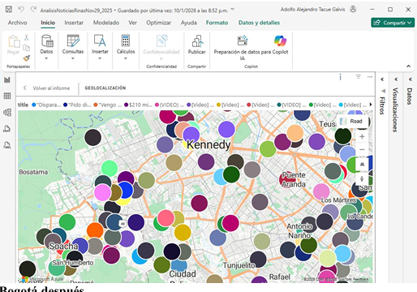
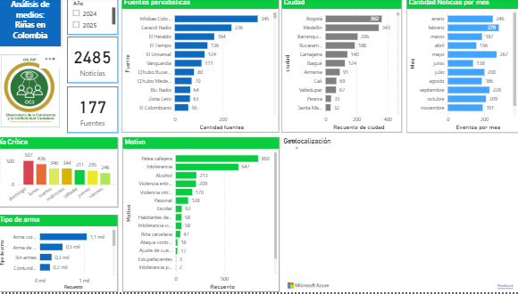

# Extractor de noticias — Qhubo / Google News RSS

> **Nota de confidencialidad** — Este repositorio se publica el 27 de abril de 2026
> exclusivamente como muestra del trabajo desarrollado dentro de la organización.
> El código y los resultados corresponden a proyectos reales que hasta esta fecha
> no habían salido del entorno interno. Se comparte con fines de portafolio para
> proceso de selección y será removido o puesto en privado una vez concluya dicho
> proceso.

Recolector de noticias por ciudad usando Google News RSS, con desofuscación
de URLs Protobuf y extracción de texto mediante trafilatura + BeautifulSoup
como fallback. Parte de un proyecto de análisis de prensa regional colombiana.

## ¿Qué hace?

Busca artículos por ciudad y rango de fechas en Google News, desencripta las
URLs (formato CBM/CBA), extrae el texto del artículo real y guarda los
resultados en JSON. Funciona con Medellín, Cali y Valledupar, cada una con
su propio script y sus medios locales configurados.

## El problema que resolvió

El recolector original fallaba en el 100% de los artículos de Medellín
(134 de 134). Las URLs nuevas de Google News vienen encriptadas con Protobuf
y algunas tienen protección anti-bot en JS. Lo solucioné integrando
`googlenewsdecoder` para desofuscar nativamente, y agregando un extractor de
emergencia con BeautifulSoup para cuando trafilatura devuelve basura o el
texto de bienvenida de Google en vez del artículo.

## Archivos principales

| Script | Ciudad | Salida |
|---|---|---|
| `news_gratis.py` | Medellín (base) | `noticias_med_2026.json` |
| `recolector_cali.py` | Cali | `noticias_cali_2026_ene_abril7.json` |
| `recolector_valledupar.py` | Valledupar | `noticias_valledupar_2026_ene_abril7.json` |

## Requisitos

```bash
pip install trafilatura beautifulsoup4 googlenewsdecoder requests
```

Opcional: si tienes clave de Groq o Together.ai, configúrala como variable de entorno
para activar limpieza de texto con LLM:

```bash
set GROQ_API_KEY=tu_clave_aqui  # Windows
```

## Uso básico

```bash
python news_gratis.py
```

Para correr el recolector completo por ciudad, ejecuta directamente el script correspondiente.
El rango de fechas está configurado para enero 1 - abril 7 de 2026.

## Notas

- Los archivos `.json` de resultados están en `.gitignore` (datos internos).
- Las claves API nunca van en el código, siempre por variable de entorno.

## Pipeline de análisis (main.go)

Una vez recolectadas las noticias, `main.go` las procesa para estructurar
la información en un formato útil para mapas y análisis.

```
go run main.go [entrada.json] [salida.json]
```

Lee un JSON de noticias crudas y produce un JSON con cada evento clasificado.

### Qué extrae por noticia

| Campo | Descripción |
|-------|-------------|
| `ciudad` | Ciudad donde ocurrió el evento |
| `departamento` | Inferido del municipio o mencionado en el texto |
| `barrio` | Barrio, vereda, estadio o punto de referencia |
| `fechaevento` | Fecha real del evento (no la de publicación) |
| `motivo` | Tipo de causa: intolerancia, alcohol, pasional, escolar, etc. |
| `tipoarma` | Arma de fuego, arma blanca, machete o vacío |
| `heridos` | Conteo de heridos mencionados |
| `fallecidos` | Conteo de fallecidos mencionados |
| `atendido` | Si hubo atención médica |
| `hospital` | Nombre del centro médico si se menciona |
| `coordenadas` | Lat/Lng vía Google Geocoding API (opcional) |

### Cómo detecta la ciudad

Usa tres fuentes en orden de prioridad:

1. Patrón explícito en el título (`en Cali`, `en Medellín`)
2. Búsqueda por scoring sobre el listado de municipios colombianos (`municipiospordepartamento.json`)
3. Nombre de la fuente periodística como fallback (ej. El País -> Cali)

Si detecta una localidad bogotana (Suba, Kennedy, Bosa, etc.) la convierte a `Bogota`
y mueve el nombre al campo `barrio`.

### Filtros de exclusión

Descarta automáticamente noticias:

- Internacionales (Venezuela, Chile, México, etc.)
- Deportivas sin componente de violencia civil
- De abuso o explotación sexual

### NER

Si hay un microservicio de NER corriendo en `localhost:5000/ner`, lo usa para refinar
ciudad y barrio. Si no está disponible, el pipeline continúa sin él.

### Geolocalización

Opcional. Si existe la variable de entorno `GEOCODE_API_KEY`, geocodifica el
barrio + ciudad y agrega coordenadas al resultado.

```bash
set GEOCODE_API_KEY=tu_clave  # Windows
export GEOCODE_API_KEY=tu_clave  # Linux/Mac
go run main.go noticias_med_2026.json resultado.json
```

### Archivo de municipios

Requiere `municipiospordepartamento.json` en el mismo directorio.
Estructura esperada:

```json
{
  "ANTIOQUIA": [{"municipio": "Medellin"}, {"municipio": "Envigado"}],
  "VALLE DEL CAUCA": [{"municipio": "Cali"}, {"municipio": "Palmira"}]
}
```

## Visualizaciones en PowerBI

El JSON de salida de `main.go` alimenta tableros en PowerBI para explorar
los eventos extraídos de las noticias: distribución geográfica, tipo de arma,
motivo y tendencia temporal.

### Mapa por localidad — Bogotá

Eventos extraídos de noticias geolocalizados dentro de Bogotá por localidad.
Permite ver dónde se concentran los incidentes reportados en prensa y cruzarlos
con variables como barrio, tipo de arma o motivo.



### Dashboard de noticias procesadas

Vista general del resultado del pipeline sobre los JSON de noticias extraídas:
total de eventos clasificados, distribución por ciudad, tipo de arma, motivo
y tendencia mensual del período analizado.


